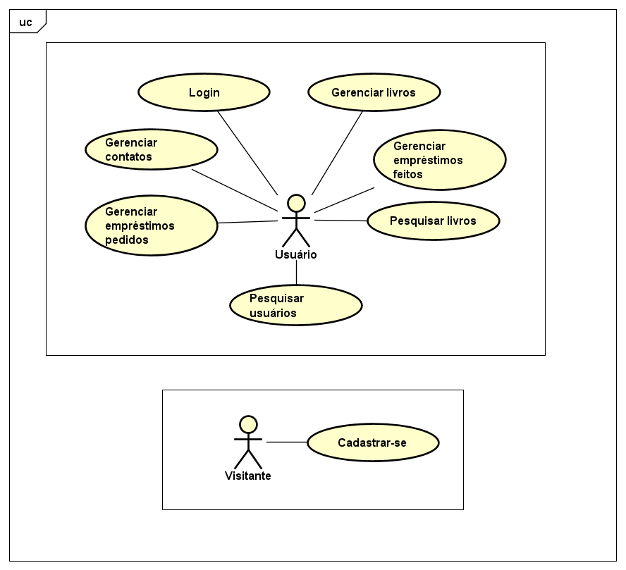

# Projeto de biblioteca pessoal
<strong>Objetivo:</strong> criar uma aplicação com angular e spring boot. O objetivo da aplicação será a criação de uma biblioteca pessoal, em que seja possível registrar livros e contatos. Na aplicação, deve ser possível a realização de empréstimos de livros para os contatos, sendo possível registrar também a devolução dos livros.

## Diagrama de casos de uso

